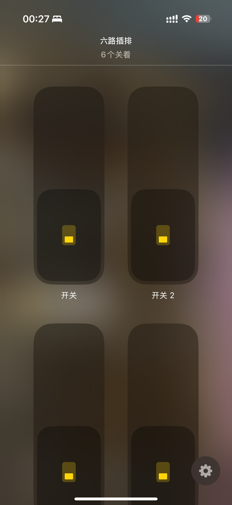
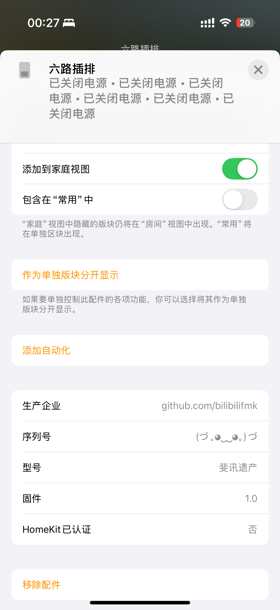
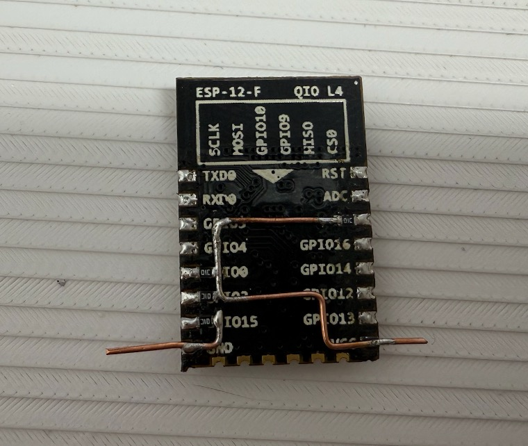
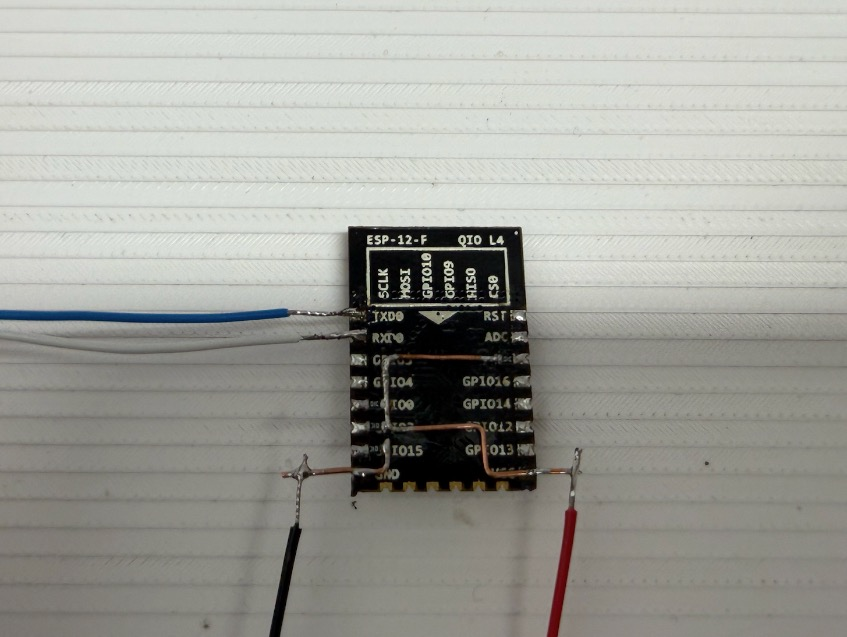
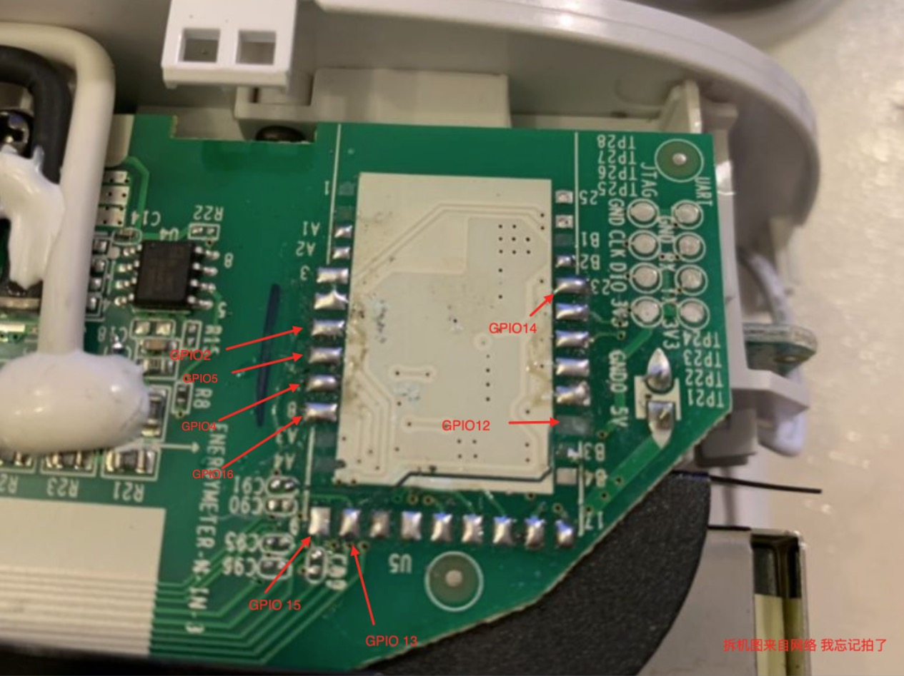
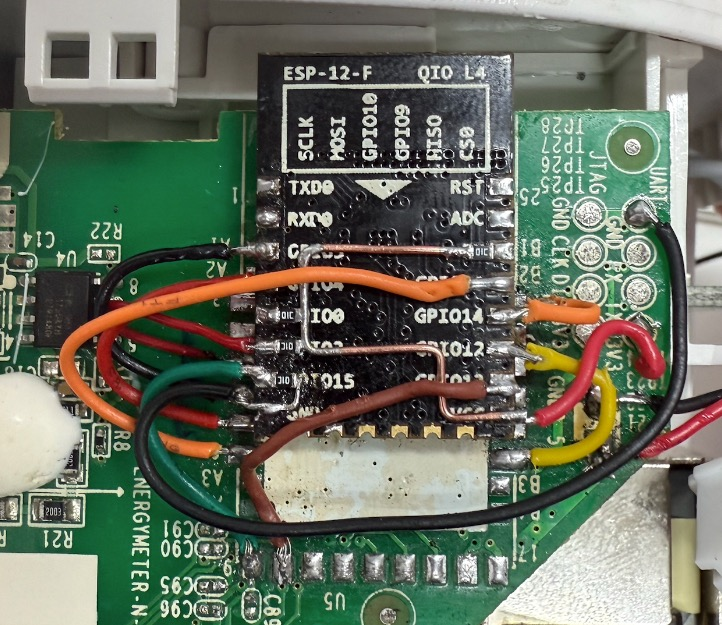

# TC1_demo
使用esp8266改造斐讯tc1插排
# 序
机缘巧合下得到的tc1插排 （mcu损坏） 正好使用8266 复活ta 理论上两个硬件版本都能改 这个项目完全是个demo 少了很多内容开发 只实现了接入homekit部分（满足我使用了）可控制六个独立的插座  如果这个项目需要的人多的话会考虑后续开发，因为我不知道原机mcu和现有其他开发者的固件体验怎么样 应该很少会直接换mcu吧？ 
## 项目基于以下项目 
* wifi_link_tool
* Arduino HomeKit ESP8266 （有修改 以提供库 将libraries内拷入你的arduino libraries 中 ）

## 效果图 

| 主页 | 详细 |
|----------|----------|
|  |  |

##  🚀 快速开始

### ✅ 推荐使用方式

- **不打算二次开发？**  
  👉 直接下载 [Releases](https://github.com/bilibilifmk/TC1_demo/releases) 中的 `.bin` 固件刷入即可使用。

---

## 🔧 硬件改造指南

### 1️⃣ 构建 ESP8266 最小系统

- 使用如下图进行焊接。
- 电阻使用 **10K 欧**。
- 焊接 TX、RX。
- 上电前将 **GPIO0 与 GND 短接**（可用镊子）进入刷机模式。

  

---

### 2️⃣ 焊接与接线说明

- 使用 3M 胶将 ESP8266 反贴于原板合适位置。
- 根据飞线图将 GPIO 对应连接至继电器控制通道。

  
  

---

### 3️⃣ 最终效果

  

---

## 💬 项目说明

- 本项目为个人用途开发，优先满足自身需求。
- 不提供过多外设支持（如网页控制、OTA、MQTT 等），仅 HomeKit。
- 欢迎 Fork、反馈、二次开发！

---

